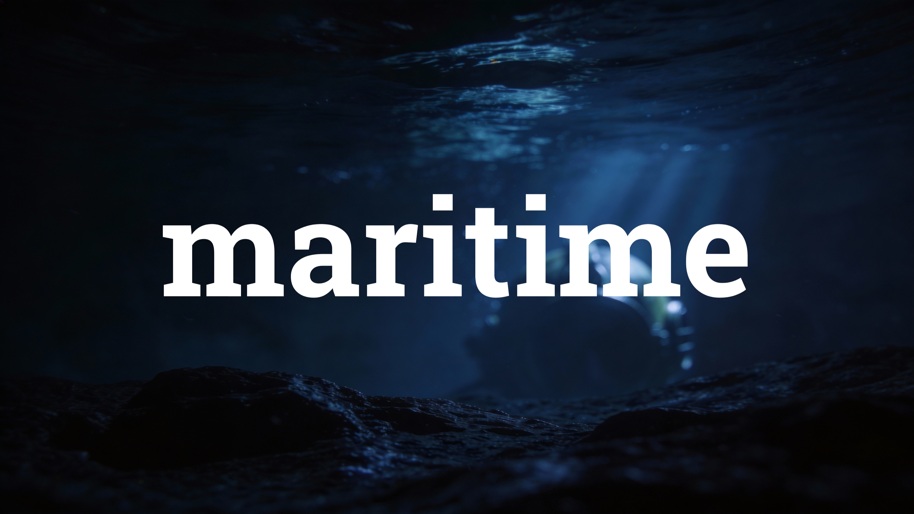

<p align="center">
  
</p>

# maritime

An AI-assisted filmmaking suite for macOS.

## Overview

maritime is a native, document-based macOS app that walks creators from a script idea to rendered shots. It's built with SwiftUI and integrates Anthropic's Claude for writing, Recraft for character art, and fal.ai for set pieces and scene rendering. Project files use the `.mblaze` extension.

## Requirements

- macOS 14 or later
- Xcode 15 or later
- [XcodeGen](https://github.com/yonaskolb/XcodeGen) — only needed if you change `project.yml`
- API keys for:
  - [Anthropic](https://console.anthropic.com/) (Claude)
  - [Recraft](https://www.recraft.ai/)
  - [fal.ai](https://fal.ai/)

  Keys are entered in the app's Preferences on first launch and stored in the macOS Keychain.

## Getting started

```sh
# Only if project.yml has changed since the last commit:
xcodegen generate

open maritime.xcodeproj
```

In Xcode, select the `maritime` scheme and press ⌘R. On first launch, open **Preferences** and paste in your API keys.

## Project structure

```
maritime/
├── App/        SwiftUI entry point, app delegate, theme
├── Models/     Document model, story bible, storyboard, exporters
├── Services/   API clients (Anthropic, Recraft, fal.ai), Photoshop bridge, Keychain
├── Views/      Feature UIs (see below)
└── Resources/  Assets and the loading video
```

The `Views/` directory is organised by feature:

- `Launcher/` — welcome / open-document flow
- `HomeView.swift` — project dashboard
- `StoryForge/` — script & story-bible editor
- `CharacterLab/` — character creation, portraits, reference sheets
- `SetDesign/` — set-piece generation
- `FrameBuilder/` — storyboard frames with AI shot breakdown
- `VideoRenderer/` — timeline, motion controls, cut suggestions
- `AssetLibrary/` — shared media browser
- `Exports/` — Premiere Pro XML and other export targets
- `Preferences/` — settings, including the **Debug** pane

## Key features

- **Story Forge** — Claude-driven script and story-bible generation.
- **Character Lab** — character portraits via Recraft, reference sheets via fal.ai.
- **Set Design** — AI-suggested set pieces rendered through fal.ai.
- **Frame Builder** — storyboard with AI shot breakdown analysis.
- **Video Renderer** — timeline with motion controls and cut suggestions.
- **Photoshop round-trip** — edit individual assets in Photoshop and pull changes back in.
- **Premiere Pro export** — real Premiere XML with placeholder stills.
- **Debug pane** — full request/response log for every AI call, viewable in Preferences.

## Debug builds

The pre-build script in `project.yml` injects the current Git branch and short SHA into `Info.plist` for Debug builds, then restores the placeholders post-build so the working tree stays clean. Both values are surfaced in **Preferences → Debug**.
